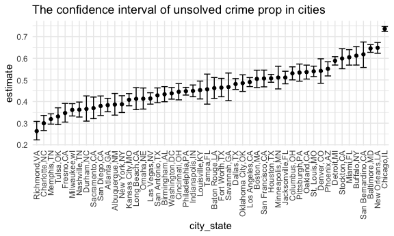
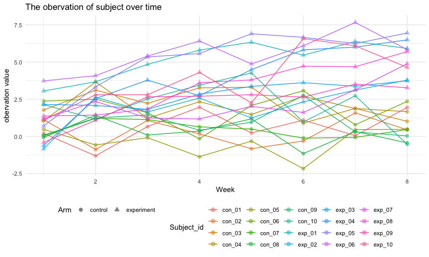

p8105_hw5_hc3212
================
Hening CUi
11/14/2021

## Problem 1

Read in the homocide data.

``` r
homo_df =
  read.csv("homicide-data.csv", na = c("", "Unknown")) 
```

The Washington Post collected data of criminal homicides over the past
decade in different cities. The data set has 52179 cases, and 12
variables which included the time, location and type of the killing,
whether an arrest was made and basic demographic information about each
victim.

``` r
homo_clean =
  homo_df %>% 
  mutate(city_state = str_c(city, ",", state),
         resolution = case_when(
           disposition == "Closed without arrest" ~ "unsolved",
           disposition == "Open/No arrest" ~ "unsolved",
           disposition == "Closed by arrest" ~ "solved"
         )) %>% 
  relocate(city_state) %>% 
  filter(city_state != "Tulsa,AL") 

homo_clean %>% 
  select(-city, -state) %>% 
  group_by(city_state) %>% 
  summarize(unsolved = sum(resolution == "unsolved"),
            n = n()) %>% 
  knitr::kable()
```

| city_state        | unsolved |    n |
|:------------------|---------:|-----:|
| Albuquerque,NM    |      146 |  378 |
| Atlanta,GA        |      373 |  973 |
| Baltimore,MD      |     1825 | 2827 |
| Baton Rouge,LA    |      196 |  424 |
| Birmingham,AL     |      347 |  800 |
| Boston,MA         |      310 |  614 |
| Buffalo,NY        |      319 |  521 |
| Charlotte,NC      |      206 |  687 |
| Chicago,IL        |     4073 | 5535 |
| Cincinnati,OH     |      309 |  694 |
| Columbus,OH       |      575 | 1084 |
| Dallas,TX         |      754 | 1567 |
| Denver,CO         |      169 |  312 |
| Detroit,MI        |     1482 | 2519 |
| Durham,NC         |      101 |  276 |
| Fort Worth,TX     |      255 |  549 |
| Fresno,CA         |      169 |  487 |
| Houston,TX        |     1493 | 2942 |
| Indianapolis,IN   |      594 | 1322 |
| Jacksonville,FL   |      597 | 1168 |
| Kansas City,MO    |      486 | 1190 |
| Las Vegas,NV      |      572 | 1381 |
| Long Beach,CA     |      156 |  378 |
| Los Angeles,CA    |     1106 | 2257 |
| Louisville,KY     |      261 |  576 |
| Memphis,TN        |      483 | 1514 |
| Miami,FL          |      450 |  744 |
| Milwaukee,wI      |      403 | 1115 |
| Minneapolis,MN    |      187 |  366 |
| Nashville,TN      |      278 |  767 |
| New Orleans,LA    |      930 | 1434 |
| New York,NY       |      243 |  627 |
| Oakland,CA        |      508 |  947 |
| Oklahoma City,OK  |      326 |  672 |
| Omaha,NE          |      169 |  409 |
| Philadelphia,PA   |     1360 | 3037 |
| Phoenix,AZ        |      504 |  914 |
| Pittsburgh,PA     |      337 |  631 |
| Richmond,VA       |      113 |  429 |
| Sacramento,CA     |      139 |  376 |
| San Antonio,TX    |      357 |  833 |
| San Bernardino,CA |      170 |  275 |
| San Diego,CA      |      175 |  461 |
| San Francisco,CA  |      336 |  663 |
| Savannah,GA       |      115 |  246 |
| St. Louis,MO      |      905 | 1677 |
| Stockton,CA       |      266 |  444 |
| Tampa,FL          |       95 |  208 |
| Tulsa,OK          |      193 |  583 |
| Washington,DC     |      589 | 1345 |

Done the prop test of Baltimore, MD.

``` r
balti_df =
  homo_clean %>% 
  filter(city_state == "Baltimore,MD")

balti_summary =     
  balti_df %>% 
  summarize(unsolved = sum(resolution == "unsolved"),
            n = n())

balti_test =
  prop.test(x = balti_summary %>% pull(unsolved), 
          n = balti_summary %>% pull(n))

balti_test %>% 
  broom::tidy()
```

    ## # A tibble: 1 × 8
    ##   estimate statistic  p.value parameter conf.low conf.high method    alternative
    ##      <dbl>     <dbl>    <dbl>     <int>    <dbl>     <dbl> <chr>     <chr>      
    ## 1    0.646      239. 6.46e-54         1    0.628     0.663 1-sample… two.sided

Now get test for each city.

Write the function first.

``` r
prop_test_function = function(city_df){
  city_summary =     
    city_df %>% 
    summarize(unsolved = sum(resolution == "unsolved"),
              n = n())

  city_test =
    prop.test(x = city_summary %>% pull(unsolved), 
              n = city_summary %>% pull(n))

  return(city_test)
}
```

Lets run thorough other cities.

``` r
result_df =
  homo_clean %>% 
  nest(data = uid:resolution) %>% 
  mutate(
    test_res = map(data, prop_test_function),
    tidy_res = map(test_res, broom::tidy)
  ) %>% 
  select(city_state, tidy_res) %>% 
  unnest(tidy_res) %>% 
  select(city_state, estimate, starts_with("conf"))
```

``` r
also_res_df =
  homo_clean %>% 
  select(-city, -state) %>% 
  group_by(city_state) %>% 
  summarize(unsolved = sum(resolution == "unsolved"),
            n = n()) %>% 
  mutate(test_res = map2(unsolved, n, prop.test),
         tidy_res = map(test_res, broom::tidy)
  ) %>% 
  select(city_state, tidy_res) %>% 
  unnest(tidy_res) %>% 
  select(city_state, estimate, starts_with("conf"))
```

Now create the plots!

``` r
result_df %>% 
  mutate(city_state = fct_reorder(city_state, estimate)) %>% 
  ggplot(aes(x = city_state, y = estimate)) +
  geom_point() +
  geom_errorbar(aes(ymin = conf.low, ymax = conf.high)) +
  theme(axis.text.x = element_text(angle = 90, vjust = 0.5, hjust=1)) +
  labs(title = "The confidence interval of unsolved crime prop in cities")
```



## Problem 2

Creat a function to read data.

``` r
read = function(name) {
  path = str_c("./data/", name)
  obser = read.csv(path)
  return(obser)
}
```

Reading the data and tidy it.

``` r
study_df = tibble(
  filename = list.files("data" )
) %>% 
  mutate(outputlist = purrr::map(.x = as.character(filename), ~read(.x))) %>% 
  unnest(outputlist) %>% 
  mutate(subject_ID = substr(filename, 1, 6 ),
           arm = substr(filename, 1, 3)) %>% 
  select(-filename) %>% 
  relocate(subject_ID, arm) %>% 
  janitor::clean_names() %>% 
  drop_na() %>% 
  pivot_longer(
    cols = week_1:week_8,
    names_to = "week",
    values_to = "value"
  ) %>% 
  mutate(week = substr(week, 6, 6))
```

Make the spaghetti plot.

``` r
study_df %>% 
  ggplot(aes(x = as.numeric(week), y = value, color = as.factor(subject_id))) +
  geom_line() + geom_point(aes(shape = as.factor(arm)), size = 2.5, alpha = 0.5) +
  labs(
    title = "The obervation of subject over time",
    y = "obervation value", 
    x = "Week",
    ) +
  scale_colour_hue("Subject_id")+
  scale_shape("Arm")
```


It could find from the graph that most experiment group have higher
observation value than the control group.

## Problem 3

Load iris dataset.

``` r
set.seed(10)

iris_with_missing = iris %>% 
  map_df(~replace(.x, sample(1:150, 20), NA)) %>%
  mutate(Species = as.character(Species))
```

Write the function of refill missing data

``` r
missing = function(miss) {
  
  if(is.numeric(miss)){
    mean_miss = round(mean(miss, na.rm = TRUE), digits = 2)
    miss = replace_na(miss, mean_miss)
  }
  
  if (is.character(miss)){
    miss = replace_na(miss, "virginica")
  }
  
  return(miss)
}
```

Refill the data, and build new data set

``` r
iris_correct = map(iris_with_missing, missing) %>% 
  bind_cols()

iris_correct
```

    ## # A tibble: 150 × 5
    ##    Sepal.Length Sepal.Width Petal.Length Petal.Width Species
    ##           <dbl>       <dbl>        <dbl>       <dbl> <chr>  
    ##  1         5.1          3.5         1.4         0.2  setosa 
    ##  2         4.9          3           1.4         0.2  setosa 
    ##  3         4.7          3.2         1.3         0.2  setosa 
    ##  4         4.6          3.1         1.5         1.19 setosa 
    ##  5         5            3.6         1.4         0.2  setosa 
    ##  6         5.4          3.9         1.7         0.4  setosa 
    ##  7         5.82         3.4         1.4         0.3  setosa 
    ##  8         5            3.4         1.5         0.2  setosa 
    ##  9         4.4          2.9         1.4         0.2  setosa 
    ## 10         4.9          3.1         3.77        0.1  setosa 
    ## # … with 140 more rows
